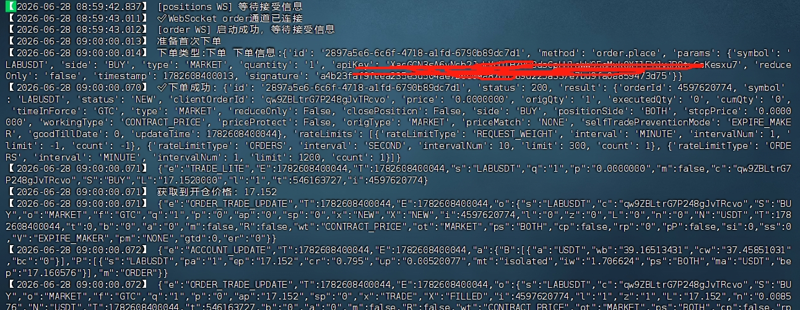

\# Binance Arbitrage System

一个基于 Python + WebSocket 的币安自动化套利交易系统，支持资金费率套利、实时持仓监控与自动对冲逻辑。

> ⚠️ 免责声明：本项目仅用于学习与研究，不构成投资建议。加密市场存在极高风险，实盘使用需自行承担后果。
> ⚠️ 代码只做部分公开，目前已实现盈利。

---

\# 🚀 功能特性

\## 📡 实时数据模块

\- WebSocket 订阅行情数据（ticker / mark price / funding rate）

\- 实时监听持仓变化

\- 自动同步账户状态

\## 💰 套利策略模块

\- 资金费率筛选（Funding Rate Filtering）

\- 多币种轮询扫描机会

\- 正/负费率双向策略支持

\- 动态开仓/平仓逻辑

\## ⚙️ 交易执行模块

\- 市价/限价下单支持

\- WebSocket 下单接口（低延迟）

\- 自动重试与失败恢复机制

\- 防重复开仓锁机制

\## 🧠 风控系统

\- 最大仓位限制

\- 单币种风险控制

\- 强制止损/止盈机制（可配置）

\- 异常断线自动恢复

